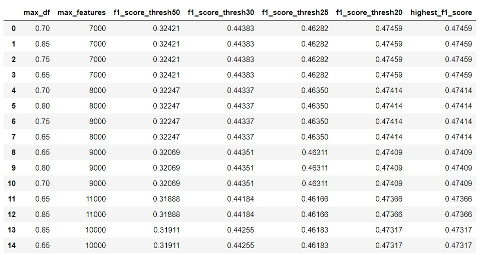
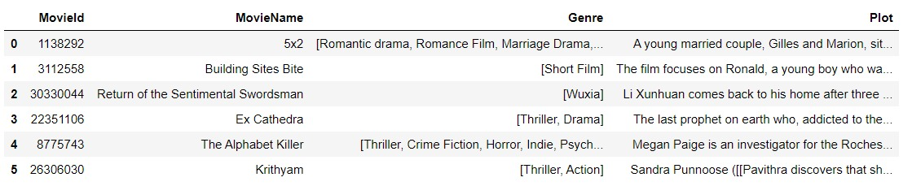

# movie-genre-classifier
Classifies movie genre based on text corpus of the plot of the movie (Multi-label classification)

## Installation
- You can install dependencies with `pip install -r requirements.txt` from the root directory

## Usage
- Use the `config.py` file in the `src` directory to change configuration settings, when necessary.
- Run `train.py` from the `src` directory to train the model OR to explore model hyperparameters.
- You can switch between model training and hyperparameter exploration by going to `src/config.py` and setting the `MODE` variable accordingly.
- In order to make predictions, use the `predict_genres_from_plot` function from the `src/predict.py` file.
```python
from predict import predict_genres_from_plot
from utils import prettify_genres

tuple_genres = predict_genres_from_plot(text="The plot of some movie") # Returns tuple of possible genre/s
print(prettify_genres(tuple_genres=tuple_genres))
```
- You can also make predictions via the Flask app by running `flask_application.py` from the `src` directory and opening the Flask app locally on your browser.

### Hyperparameter exploration and logging
You can log hyperparameters and evaluation metrics.


### Training data
This is what the training data looks like.
